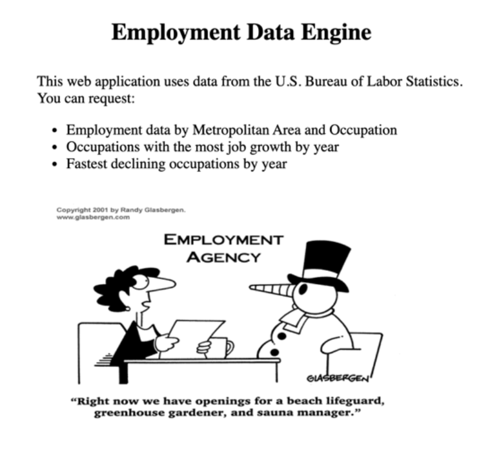
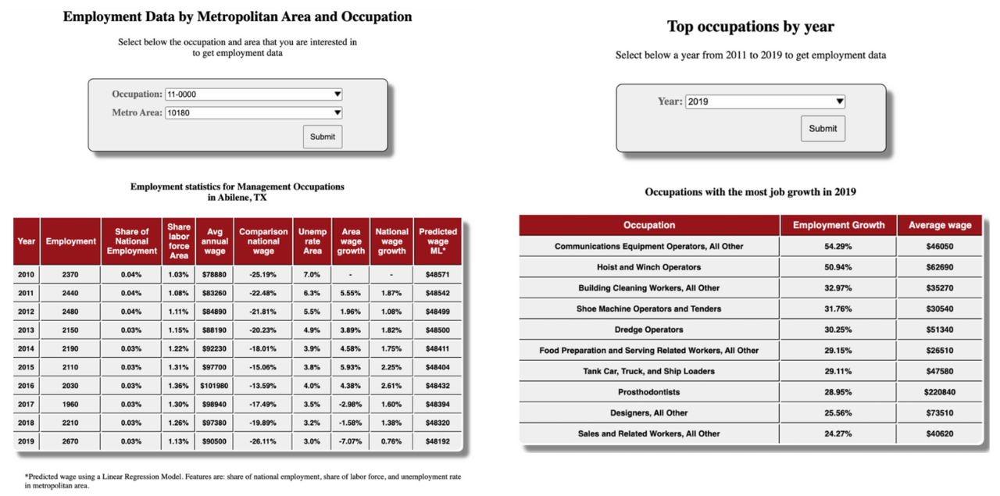

# Employment Engine

## Overview

In this project I used big data technologies like Hadoop, Hive and Spark to build a web application that allows the user to search for employment statistics by occupation and Metropolitan Area. The app also shows the occupations with the most job growth by year.

## Data
This web application uses data from the U.S Bureau of Labor Statistics.
* Occupational Employment Statistics: Employment data by metropolitan area and occupation (yearly), national employment data by occupation (yearly).
* Metropolitan Area and Unemployment: Quarterly unemployment rates by metropolitan area.

The data was downloaded from the BLS webpage and loaded into an Amazon S3 bucket.

## Tools
First I mapped the csv data in Hive and then I created an ORC table for each dataset.
Then I joined the tables in Spark and created the views. Finally, I created the tables in Hbase.

